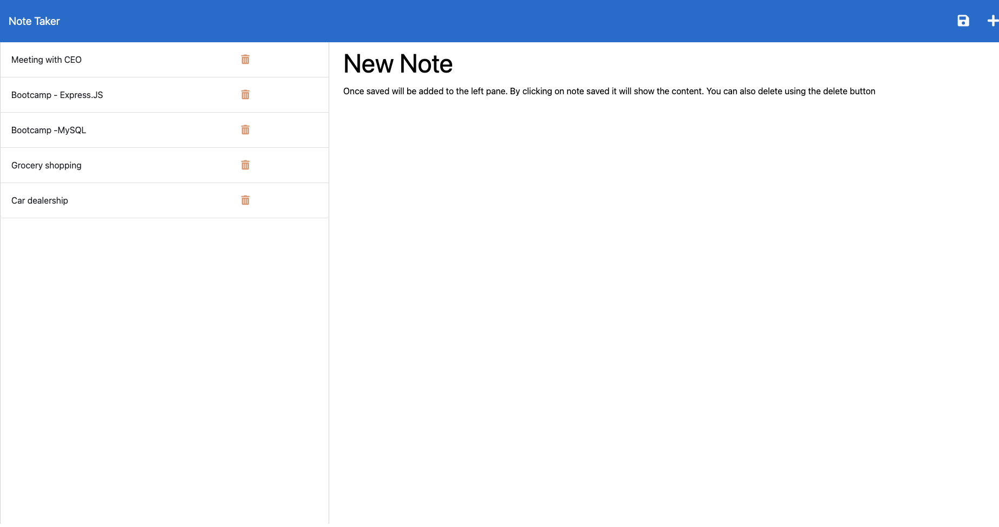

  # Note Taker using Express.JS

  ## Description
  Our daily life is filled with maky activities and events. It is important to keep track of activities so as not to forget them in teh course of the day. This application is supposed to help individuals to track activities using Epress.js back end to save and retrieve notes from JSON file. The front end and the back end are conected to help accomplish the task. The entire application will was deployed to [Heroku](https://aqueous-scrubland-64716-bdf7e391ca6e.herokuapp.com/notes). The user story and acceptance criteria is below.
  
  ## Table of Contents
  - [User Story](#UserStory)
  - [Acceptance Criteria](#AcceptanceCriteria)
  - [Appearance and  Functionality](#Appearance&Functionality)
  - [Questions](#questions)
  - [Credits](#Credits)
  
  ## User Story
```
AS A small business owner
I WANT to be able to write and save notes
SO THAT I can organize my thoughts and keep track of tasks I need to complete
```


  ## Acceptance Criteria
```
GIVEN a note-taking application
WHEN I open the Note Taker
THEN I am presented with a landing page with a link to a notes page
WHEN I click on the link to the notes page
THEN I am presented with a page with existing notes listed in the left-hand column, plus empty fields to enter a new note title and the note’s text in the right-hand column
WHEN I enter a new note title and the note’s text
THEN a Save icon appears in the navigation at the top of the page
WHEN I click on the Save icon
THEN the new note I have entered is saved and appears in the left-hand column with the other existing notes
WHEN I click on an existing note in the list in the left-hand column
THEN that note appears in the right-hand column
WHEN I click on the Write icon in the navigation at the top of the page
THEN I am presented with empty fields to enter a new note title and the note’s text in the right-hand column
```

  ## Appearance and  Functionality
  

  ## Questions
  For any questions or suggestions, feel free to reach out to me on GitHub: [StanOp09](https://github.com/StanOp09) or via email: stanleykaopare@gmail.com.

  ## Credits
  - Sean Roshan
  - Chat GPT
  - [NPM](https://www.npmjs.com/)
  - [NodeJS](https://nodejs.org/en)
  - [Express.js](https://expressjs.com/)
  - [Heroku](https://www.heroku.com/)